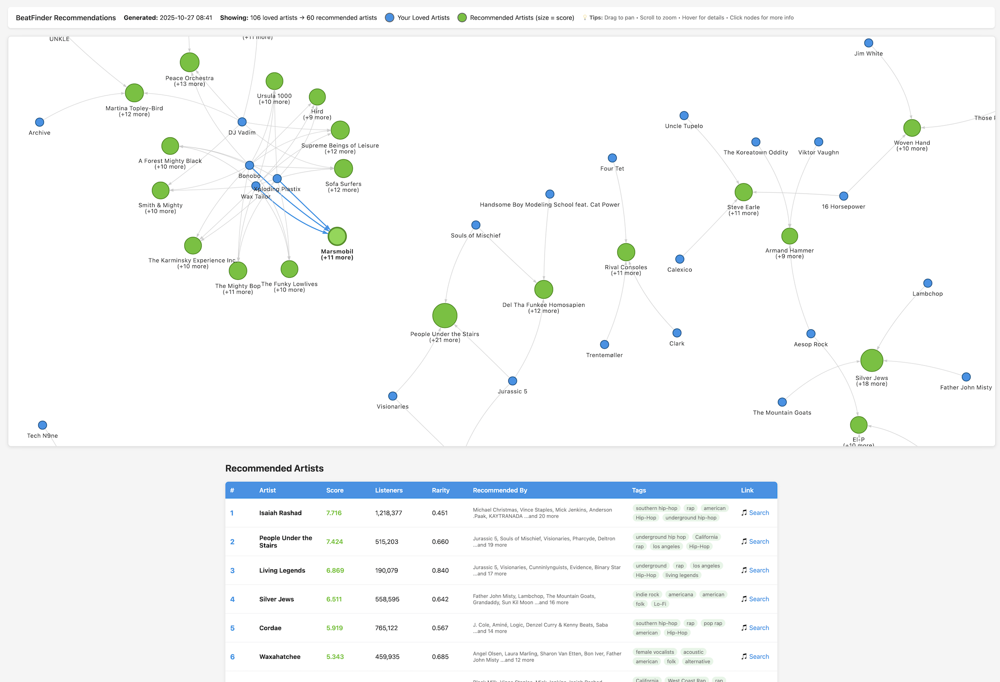
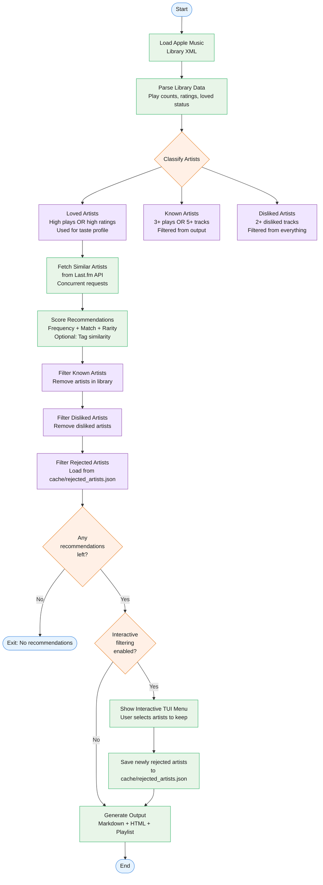

# BeatFinder

Discover new artists based on your Apple Music library using Last.fm's recommendation engine.



## How It Works



## Features

- Extracts your Apple Music library data from XML export (artists, play counts, loved status, play dates)
- Fetches similar artists from Last.fm API
- Filters out artists you've already heard
- Interactive TUI menu for reviewing and rejecting recommendations (enabled by default)
- Scores recommendations by frequency, similarity, and rarity
- Optional advanced features:
  - Tag similarity matching (recommends artists matching your music taste profile)
  - Play frequency weighting (prioritises recommendations from your most-played artists)
  - Time-based filtering (recommendations based on recent listening patterns)
  - Apple Music playlist creation (automatically builds a playlist with top songs from recommendations)
  - HTML visualisation (interactive network graph showing recommendation connections)
- Caches API responses to minimise requests
- Concurrent API requests for faster processing

## Requirements

- macOS with Apple Music/Music.app
  - Export of your library XML (File → Library → Export Library...)
- Python 3.9+
- Last.fm API key (free)

## Setup

1. Install dependencies:
```bash
pip install -r requirements.txt
```

2. Get a Last.fm API key:
   - Visit https://www.last.fm/api/account/create
   - Create an account and generate an API key

3. Configure:
```bash
cp .env.example .env
# Edit .env and add your Last.fm API key
```

## Usage

### First run - export your library:

1. Export your Apple Music library:
   - Open Music.app
   - File → Library → Export Library...
   - Save as `Library.xml` to your Downloads folder

2. Run the script (parses the XML and fetches recommendations):
```bash
python beatfinder.py
```

Shows progress for large libraries:
```
Parsing library XML: /Users/you/Downloads/Library.xml
File size: 137.3 MB
✓ Parsed in 6.6 seconds
Processing 99,742 tracks...
  Processed 10,000 / 99,742 tracks...
  ...
✓ Found 8,563 artists
✓ Library data cached for future runs

Analysing 1,770 loved/frequently played artists...
  Progress: 500/1770 artists processed...
```

### Subsequent runs - use cached data (fast):
```bash
python beatfinder.py
```

Uses cached recommendations if available and valid. This is very fast since it skips recommendation generation.

### Refresh Last.fm metadata cache:
```bash
python beatfinder.py --refresh-cache
```

Clears Last.fm API cache and fetches fresh artist metadata. Keeps recommendations cache intact.

### Regenerate recommendations:
```bash
python beatfinder.py --refresh-recommendations
```

Clears recommendations cache and regenerates with current settings. Keeps Last.fm API cache intact (fast - no API calls needed).

Use this when you've updated filtering settings (like `KNOWN_ARTIST_MIN_TRACKS`) and want to apply them without refetching Last.fm data.

### Clear all caches:
```bash
python beatfinder.py --refresh-all
```

Clears both Last.fm and recommendations caches completely, forcing full regeneration.

### Regenerate HTML visualisation:
```bash
python beatfinder.py --regenerate-html
```

Regenerates just the HTML visualisation from cached recommendations (very fast). Useful for fixing visualisation issues without reprocessing recommendations.

### Adjust number of recommendations:
```bash
python beatfinder.py --limit 20
```

### Change rarity preference:
```bash
python beatfinder.py --rarity 12  # 1 (most popular) to 15 (most obscure)
```

### Interactive filtering:

By default, BeatFinder shows an interactive menu where you can review and reject recommendations before saving them:

```bash
python beatfinder.py  # Shows interactive menu (default)
```

Use SPACE to toggle artists you want to keep, then press ENTER to confirm. Rejected artists are cached and won't appear in future recommendations.

To skip the interactive menu for a single run:
```bash
python beatfinder.py --no-interactive
```

To clear rejected artists cache:
```bash
python beatfinder.py --clear-rejected
```

To disable interactive filtering permanently, set in `.env`:
```
ENABLE_INTERACTIVE_FILTERING=false
```

## Output

Results are written to `recommendations.md` with:
- Artist name
- Rarity score
- Recommended by which artists in your library
- Top genre tags
- Apple Music search link

## Configuration

Edit `.env` to customise:

### Basic Settings
- `MAX_RECOMMENDATIONS` - Number of artists to recommend (default: 15)
- `RARITY_PREFERENCE` - Scale from 1 (most popular) to 15 (most obscure), default: 7
  - 1-5: Mainstream artists with large followings
  - 6-10: Balance between popular and obscure
  - 11-15: Very obscure/underground artists with small listener counts

### Artist Classification

BeatFinder uses two distinct concepts to generate recommendations:

**"Known" Artists** (filtered from recommendations):
Artists matching either of these criteria won't be recommended (you already know them):
- `KNOWN_ARTIST_MIN_PLAY_COUNT` - Minimum plays threshold (default: 3)
- `KNOWN_ARTIST_MIN_TRACKS` - Minimum tracks in library (default: 5)

The track count filter is especially useful for Apple Music streaming users, where play counts may be 0 but you have many tracks added to your library. If you have 5+ tracks by an artist, you clearly know them!

**"Loved" Artists** (used to build your taste profile):
- Artists matching any of these criteria are used to find similar artists:
  - `LOVED_PLAY_COUNT_THRESHOLD` - High total play count alone (default: 50 plays), OR
  - High rating with minimum plays:
    - `LOVED_MIN_TRACK_RATING` - Minimum star rating (1-5 scale) of artist's highest-rated track (default: 4)
    - `LOVED_MIN_ARTIST_PLAYS` - Minimum total plays across all tracks by that artist (default: 10)
  - Any track explicitly marked as "loved" in Apple Music

Examples:
- Artist with 100 total plays, no ratings → LOVED ✓ (qualifies via play count)
- Artist with 60 total plays, highest track rated 3★ → LOVED ✓ (qualifies via play count)
- Artist with 15 total plays, highest track rated 5★ → LOVED ✓ (qualifies via rating: 5★ ≥ 4★ AND 15 ≥ 10)
- Artist with 5 total plays, highest track rated 5★ → NOT loved ✗ (below 10 play minimum for rating qualification)
- Artist with 2 total plays, any rating → NOT loved ✗ + NOT known ✗ (could still be recommended)

### Cache Settings
- `CACHE_EXPIRY_DAYS` - How long to keep cached Last.fm metadata (default: 7 days)
- `RECOMMENDATIONS_CACHE_EXPIRY_DAYS` - How long to keep cached recommendations (default: 7 days)

When you run the script, it caches the generated recommendations. Subsequent runs will use the cached recommendations if they're still valid (not expired and matching the current rarity preference). This means you can quickly regenerate the HTML visualisation or markdown output without re-processing everything.

### Performance Settings
- `MAX_CONCURRENT_REQUESTS` - Number of parallel Last.fm API requests (default: 10, higher = faster but more aggressive)
- `MAX_REQUESTS_PER_SECOND` - Global rate limit for API requests (default: 5, matches Last.fm's limit of 5 req/sec)

### Advanced Features (Optional)
- `ENABLE_TAG_SIMILARITY` - Match recommendations to your music taste profile (default: false)
- `ENABLE_PLAY_FREQUENCY_WEIGHTING` - Prioritise recommendations from most-played artists (default: false)
- `LAST_MONTHS_FILTER` - Only consider artists played in last N months, 0 = all time (default: 0)
- `TAG_IGNORE_LIST` - Comma-separated list of tags to exclude from similarity scoring (e.g., `pop,christmas,instrumental`). These tags won't influence recommendations but won't blacklist artists that have them (default: empty)

### Apple Music Playlist Creation
- `CREATE_APPLE_MUSIC_PLAYLIST` - Automatically create a playlist with top songs from recommended artists (default: false)
- `PLAYLIST_SONGS_PER_ARTIST` - Number of songs to add per artist (default: 3)
- `APPLE_MUSIC_SCRAPE_BATCH_SIZE` - Number of concurrent browsers for scraping (default: 5)

**How it works:**
1. Scrapes Apple Music catalogue to find top songs for each recommended artist
2. Creates a playlist named "BeatFinder - YYYY-MM-DD" in your Apple Music library
3. Only adds songs you don't already have (prevents duplicates)
4. Handles regional availability automatically

**Token setup** (required for playlist creation):

The playlist feature uses Apple Music's web API via browser-extracted tokens (no Apple Developer subscription needed):

1. Log into https://music.apple.com in your browser
2. Open browser developer tools (F12 or Cmd+Option+I)
3. Extract two tokens:
   - **Dev Token**: Check the Network tab for requests to `amp-api.music.apple.com`. Look for the `Authorization: Bearer ...` header, or find `devToken` in URL parameters. Copy everything after "Bearer "
   - **Media User Token**: Check Application/Storage → Cookies for `music.apple.com`, find `media-user-token`, or look in the Network tab for the `Media-User-Token` header
4. Add to your `.env` file:
   ```
   APPLE_MUSIC_WEB_DEV_TOKEN=eyJhbGciOiJFUzI1NiI...
   APPLE_MUSIC_WEB_MEDIA_USER_TOKEN=Ajod0fqyLkVDn4h...
   ```

**Token expiry:**
- Dev token: ~6 months
- Media user token: ~2-4 weeks
- When expired, re-extract from browser using steps above

### HTML Visualisation
- `GENERATE_HTML_VISUALISATION` - Generate an interactive HTML visualisation showing recommendation connections (default: false)

When enabled, creates `recommendations_visualisation.html` with an interactive network graph showing:
- Your loved artists (blue nodes) connected to recommended artists (green nodes)
- Hover tooltips with artist metadata (score, listeners, tags)
- Interactive features: drag, zoom, click to select
- Arrows showing which of your artists led to each recommendation

### Scoring Weights (when advanced features enabled)
- `SCORING_FREQUENCY_WEIGHT` - How many of your artists recommend this (default: 0.3)
- `SCORING_TAG_OVERLAP_WEIGHT` - How well tags match your profile (default: 0.3)
- `SCORING_MATCH_WEIGHT` - Last.fm's similarity rating (default: 0.2)
- `SCORING_RARITY_WEIGHT` - Artist obscurity (default: 0.2)

Note: Weights must sum to 1.0

## How It Works

1. Parses your Apple Music library XML export to extract:
   - Artist play counts and ratings
   - Loved status
   - Last played dates (for time filtering)
2. Identifies your "loved" artists (high play count or 4+ star rating)
3. Optionally filters to recent listening period
4. Builds your music taste profile from genre tags (if enabled)
5. Queries Last.fm concurrently for similar artists
6. Scores recommendations by:
   - Frequency (how many of your artists recommend this)
   - Tag similarity (how well it matches your taste profile)
   - Match score (Last.fm's similarity rating)
   - Rarity (based on Last.fm listener counts)
   - Play frequency weighting (recommendations from most-played artists ranked higher)
7. Filters out artists already in your library or barely played
8. Fetches detailed info for top recommendations
9. Outputs ranked recommendations to `recommendations.md`

## Licence

MIT
